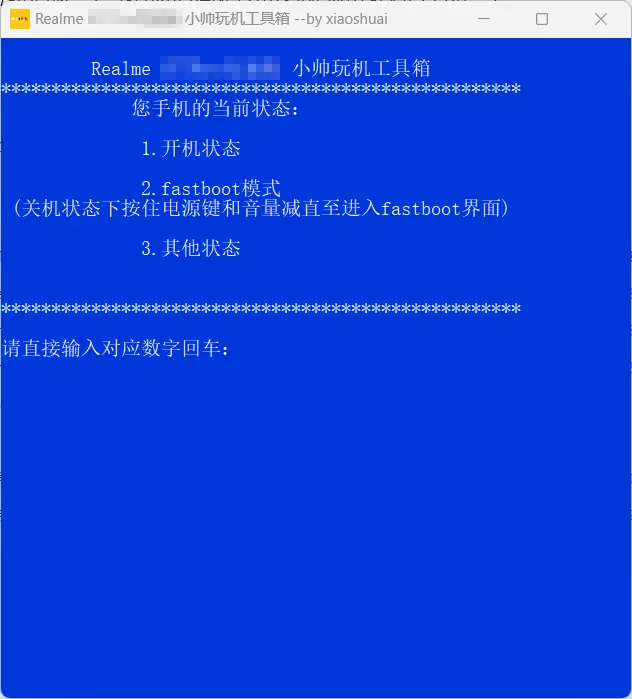
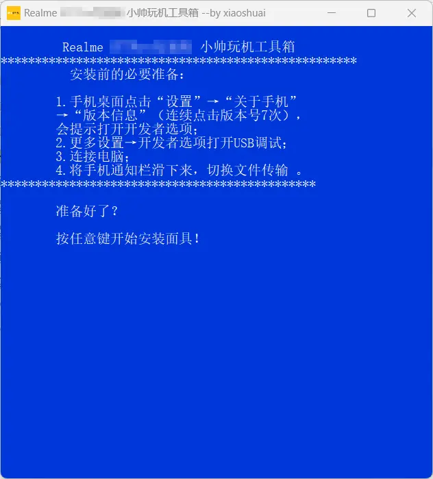

import ToolBase from '@site/src/components/DocsTxt/Tool/Base.md'
import DevMode from '@site/src/components/DocsTxt/Tool/DevMode'
import Hardware from '@site/src/components/DocsTxt/Tool/Hardware.md'

# ROOT 工具 ROOT 教程

:::important
若未解锁，请先按照[解锁教程](unlock)解锁！
:::

## 准备工作

### 硬件准备

<Hardware />

#### 开启 USB 调试

<DevMode opt='USB 调试' />

## 刷入 ROOT

<ToolBase />

使用数据线连接设备与电脑

:::tip
如果是在开机状态，需要注意以下几点:

1. 如果是开启 `USB 调试` 后第一次连接电脑，会提示是否允许电脑进行 USB 调试，此时请勾选一律允许调试并确认
2. 如果连接电脑后提示选择连接模式，请选择传输文件（即 MTP 模式）

如果是在关机状态，则需要同时长按 `音量-键` 与 `电源键` 以进入 `BootLoader` 模式
:::

输入 `6`(刷入 ROOT) 并按 `回车键`，依照实际情况选择当前状态

输入当前状态对应的数字并按 `回车键` 后，会刷入 ROOT 并自动重启

重启后桌面新增一个 Android 原生图标的软件（即 ROOT 自带的默认管理器），则说明刷入成功

:::note
如果已经提前安装好 ROOT 管理器，则不会再出现一个新的软件，
除非安装的 ROOT 管理器与当前刷入的 ROOT **不匹配**，此时仍需要再安装匹配的 ROOT 管理器
:::

由于默认管理器会从 GitHub 下载完整版管理器，但是国内网络环境很难下载成功，
因此需要再使用工具箱安装 ROOT 管理器

返回工具箱主页后，输入 `3`(安装 ROOT 管理器) 并按 `回车键`

:::important
设备重启后仍需要按先前教程所描述的办法来保证设备与电脑正常连接
:::

通过工具箱安装时，设备会提示安装 ROOT 管理器，确认安装即可

ROOT 管理器安装成功后，进入管理器，
若提示修复运行环境，则需要确认修复，在安装选项中选择 `直接安装` 并确认，
安装成功并重启后，便成功获取 ROOT 权限

> **至此，ROOT 完毕**
>
> 如果想要玩得更得心应手，参见 [玩机资源](../resources)
