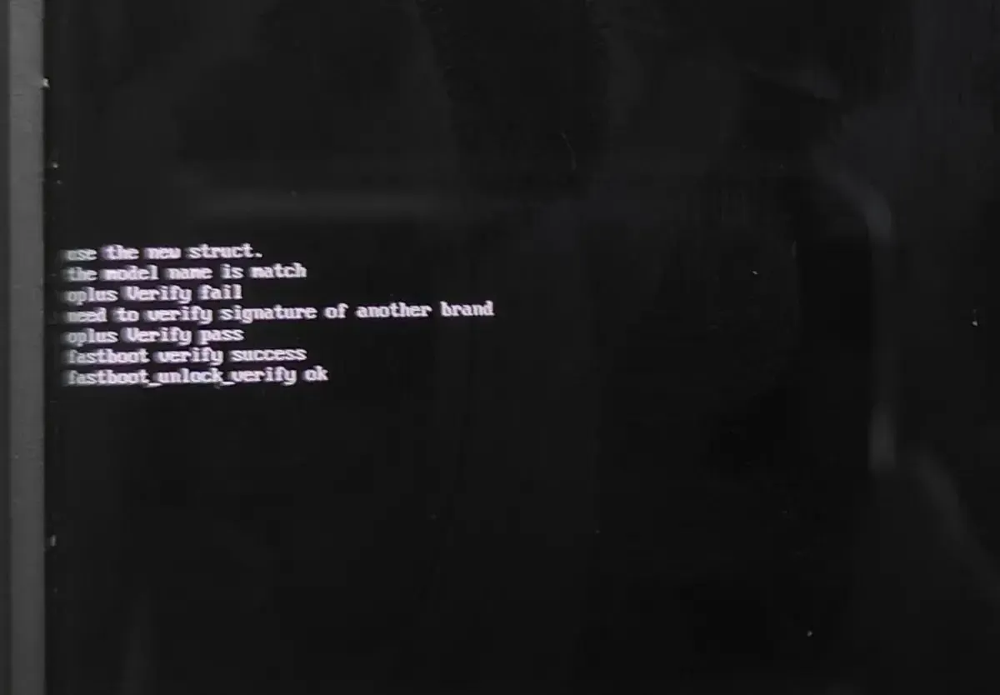
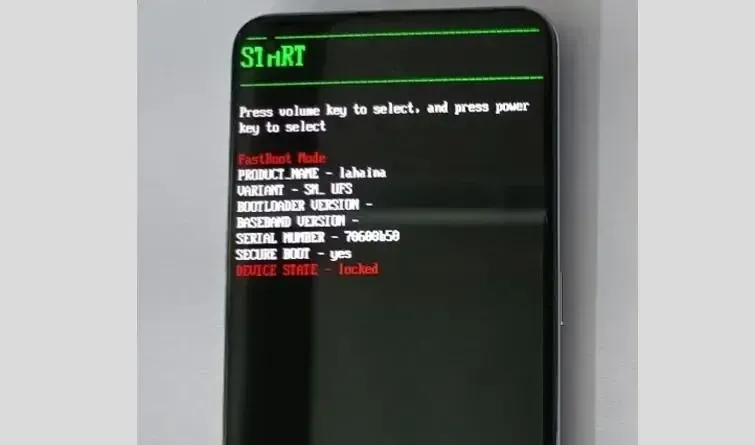
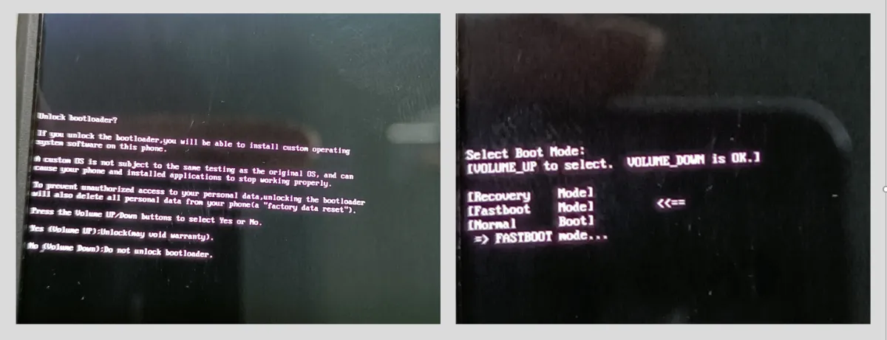
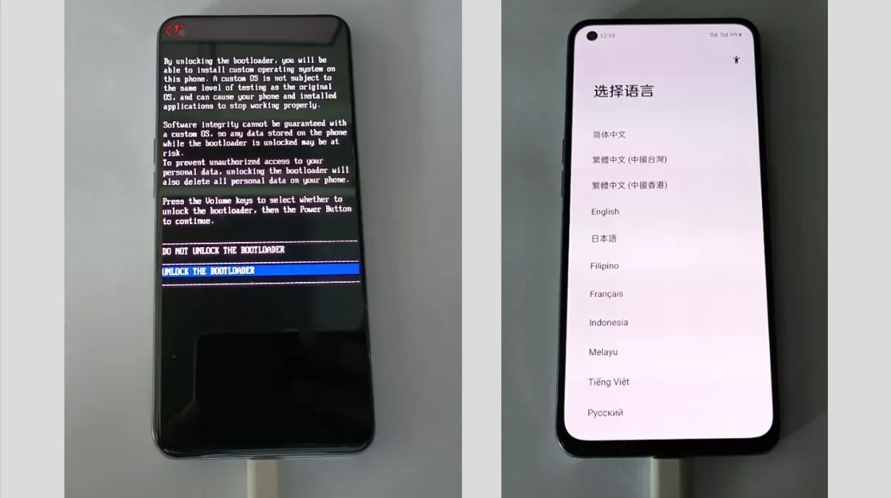

import Admonition from '@theme/Admonition'
import TabItem from '@theme/TabItem'
import Tabs from '@theme/Tabs'

import ToolBase from '@site/src/components/DocsTxt/Tool/Base.mdx'
import DevMode from '@site/src/components/DocsTxt/Tool/DevMode'
import Hardware from '@site/src/components/DocsTxt/Tool/Hardware.mdx'

# 深度测试解锁教程

:::warning
停止维护的旧机型无法使用深度测试！仅可通过漏洞强行解锁！

不支持深度测试的机型如下:

- GT Neo
- GT Neo 闪速版
- GT Neo2T
- GT 大师版
- GT 大师探索版
- GT Neo2 (以及 `龙珠定制版`)

支持通过漏洞强行解锁的机型如下:

- GT Neo
- GT Neo 闪速版
- GT Neo2T
- GT 大师探索版
- GT Neo2 (以及 `龙珠定制版`)

> [高通骁龙 865、870、8Gen2 漏洞强行解锁教程](https://www.coolapk.com/feed/57282902?s=ODAwZTVmYzk1YjFjMzBnNjhkMTI2ODF6a1550)

:::

## 解锁要求

- 国行零售版设备，非政企定制版
- 欢太账号在六十天内没有申请过解锁

## 解锁名额

- GT 系列发布会后一个月第一次首次开放 **300** 名额，次月开始至停止维护**每月 1 日**释放 **200** 名额
- 其他系列发布会后一个月第一次首次开放 **200** 名额，次月开始至停止维护**每月 1 日**释放 **200** 名额

:::note
机型发布会之后可能会随缘开放首批名额！
:::

## 解锁审核

申请成功后七天完成审核，解锁码的时间限制为 7 天，超过 7 天需要重新申请

:::warning
解锁前不可以进行 UI 大版本更新！

解锁仅可在指定的 UI 大版本下申请，如果进行了大版本更新，则会无法通过审核，需要重新降级！

> 每个机型可以解锁的 UI 大版本已在各机型页面中注明

:::

:::note
部分官方信息不可信，只要申请之后不更换账号、不更新 UI 大版本，理论不会有过期限制
:::

## 申请流程

### 准备工作

#### 硬件准备

<Hardware />

#### 安装深度测试软件

下载深度测试软件并安装

> [官方链接](https://r11.realme.net/CN/thread-attachment/797558050625016185.zip)
>
> [夸克网盘链接](https://pan.quark.cn/s/c44a85260c72)

:::tip
官方链接下载后为 ZIP 压缩包，请在下载后解压以获取深度测试的 APK 安装包！

夸克网盘链接下载后为直接的 APK 安装包
:::

#### 开启 OEM 解锁

<DevMode opt='OEM 解锁' />

### 申请解锁

1. 进入 `深度测试` 软件
2. 登录欢太账号
3. 点击 `开始申请`，勾选 `我已阅读并同意上述内容`，然后点击 `提交申请`

:::warning[确保申请成功]
返回到申请页面后，请点击 `查询审核状态` 来查看是否申请成功！

若没有申请成功，请检查是否满足要求！
:::

## 解锁设备

:::danger
解锁会清除设备数据！请确保重要数据都备份后再解锁！
（请备份到其他设备或云端上，不要备份到当前设备上！）
:::

审核通过后，在 `深度测试` 软件中点击 `开始深度测试`，让设备重启至 `BootLoader` 模式

:::note
`BootLoader` 模式 并非常规的手机页面！进入后显示的各种文字可以不用理会！
:::

<Tabs groupId='device' queryString>
	<TabItem value='mtk' label='联发科 BootLoader 界面'>
		
	</TabItem>
	<TabItem value='qcom' label='高通 BootLoader 界面'>
		
	</TabItem>
</Tabs>

:::important
联发科处理器机型与高通处理器机型的 BootLoader 界面并不相同！

并且两种机型在解锁方式上也有所差异，请确认好自己机型的处理器厂商！
:::

### 使用 ROOT 工具解锁

<ToolBase />

确保设备已经进入到 BootLoader 界面后，使用数据线连接设备与电脑

输入 `4`(解锁 BootLoader 锁) 并按 `回车键`，然后开始解锁

工具箱会执行解锁操作，但仍需要手动通过按键确认解锁，具体操作如下

:::danger
联发科处理器机型与高通处理器机型的解锁方式并不相同！请确认好自己机型的处理器厂商！
:::

<Tabs groupId="device" queryString>
<TabItem value='mtk' label='联发科解锁方式'>
按压 `音量+键`，确认解锁

<Admonition type="caution">

在较新系统版本解锁时，确认解锁会有**三秒**时间限制！超时则会无法确认解锁！

如果超时，则需要同时长按 `音量+键` 与 `电源键` 以强制重启，然后重新通过 `深度测试` 软件进入 `BootLoader` 模式，再通过工具箱解锁

</Admonition>

解锁完毕后，同时长按 `音量+键` 与 `电源键` 以强制重启，即可重启至系统

</TabItem>
<TabItem value='qcom' label='高通解锁方式'>

按压 `音量-键`，再按压 `电源键` 以确认解锁

</TabItem>
</Tabs>

:::note
联发科处理器机型与较新系统版本的高通处理器机型在解锁后每次开机时会显示**几行文字**，**并不影响使用**！
:::

> **至此，解锁完毕**
>
> 刷入 ROOT 参见 [ROOT 教程](root)
