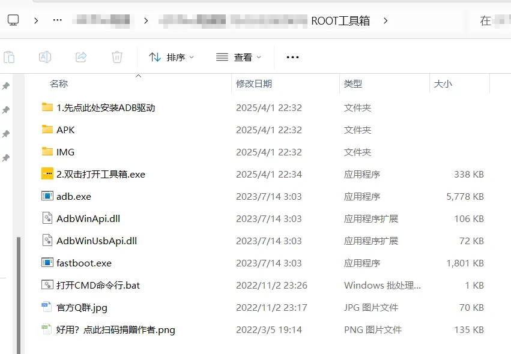
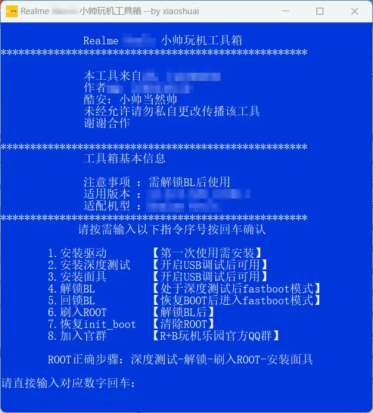
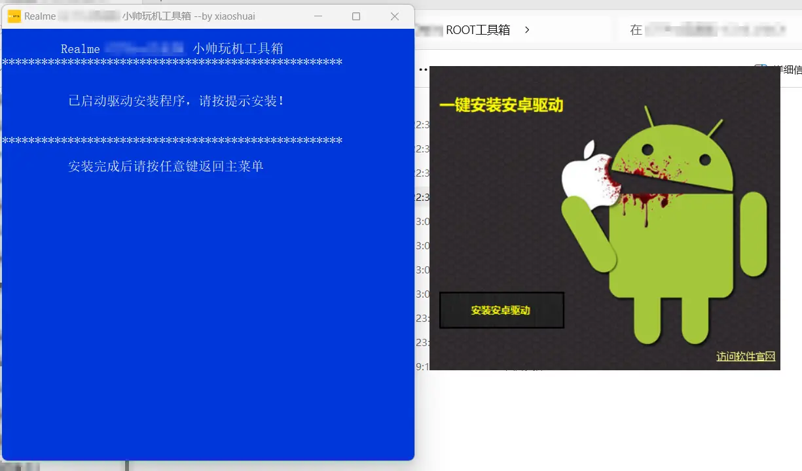

:::important
请先提前下载好 ROOT 工具

> ROOT 工具请[**加群获取**](/qq)，长期免费更新，加入后查看群公告即可

部分重复操作无需重复执行！
:::

打开下载好的 ROOT 工具并解压，得到一个文件夹后，进入该文件夹

然后通过鼠标 **`左键` 双击** 来打开 `双击打开工具箱.exe` 程序

:::note
如果没有在资源管理器中打开**显示`文件拓展名`**，则不会有 `exe` 后缀，虽然不影响使用，但是建议打开！
:::

:::note
例图来自于有 `init_boot` 分区机型的 ROOT 工具，与仅有 `boot` 分区机型略有差异，但在本教程中不影响使用！
:::

:::important
如果电脑还未安装 Android 驱动，则需要执行以下操作:

> 安装过则可以省略该步骤

先输入 `1`(安装驱动) 并按 `回车键`，按照提示安装驱动，然后再返回工具箱主页

:::

:::caution
务必保证驱动正确安装！

未安装驱动或未正确安装驱动，会在进入 `BootLoader` 模式时电脑无法正确识别设备！
:::
